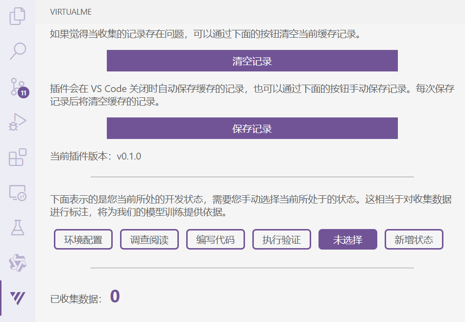

<h1 align="center">VirtualMe</h1>

VirtualMe is a VS Code plugin <i>under development</i> for collecting developer action sequences and providing developer intention prediction in the IDE.

| <a href="https://github.com/iseg-ide-sub1/virtual-me/blob/main/res/docs/contributing.md"><b>Contributing</b></a> | <a href="https://github.com/iseg-ide-sub1/virtual-me/blob/main/res/docs/plugin-architecture.md"><b>Architecture</b></a> |

## 安装和使用

1. 打开扩展，选择“从VSIX安装...”

   
2. 选择本插件 `.vsix` 文件打开，安装完成

   
3. 按 `Ctrl+Shift+P` 打开命令面板，输入 `virtualme.activate` 启动插件

   
4. 此时即可开始在 IDE 进行工作
5. 按 `Ctrl+Shift+P` 打开命令面板，输入 `virtualme.savelog` 保存操作记录

   
6. 操作记录被保存在当前工作目录下的 `./log` 文件夹

   > 注意：只要启动了插件，如果没保存操作记录，插件会在 IDE 退出时自动保存
   >

   

## 信息收集清单

### 数据收集格式

### 数据收集类型

收集数据的触发条件和详细格式见 [**plugin-architecture.md**](./res/docs/plugin-architecture.md)

#### 文件操作

| 编号 | 名称           | 符号                   |
| ---- | -------------- | ---------------------- |
| 1-1  | 打开文本文件   | `OpenTextDocument`   |
| 1-2  | 关闭文本文件   | `CloseTextDocument`  |
| 1-3  | 切换文本编辑器 | `ChangeTextDocument` |
| 1-4  | 新建文件       | `CreateFile`         |
| 1-5  | 删除文件       | `DeleteFile`         |
| 1-6  | 保存文件       | `SaveFile`           |
| 1-7  | 重命名文件     | `RenameFile`         |
| 1-8  | 移动文件       | `MoveFile`           |

#### 文本内容操作

| 编号 | 名称         | 符号                 |
| ---- | ------------ | -------------------- |
| 2-1  | 添加文件内容 | `AddTextDocument`    |
| 2-2  | 删除文件内容 | `DeleteTextDocument` |
| 2-3  | 修改文件内容 | `EditTextDocument`   |
| 2-4  | 重做文件内容 | `RedoTextDocument`   |
| 2-5  | 撤销文件内容 | `UndoTextDocument`   |
| 2-6  | 选中文本     | `SelectText`         |
| 2-7  | 鼠标悬停     | `MouseHover`         |

#### 终端操作

| 编号 | 名称     | 符号                     |
| ---- | -------- | ------------------------ |
| 3-1  | 打开终端 | `OpenTerminal`         |
| 3-2  | 关闭终端 | `CloseTerminal`        |
| 3-3  | 切换终端 | `ChangeActiveTerminal` |
