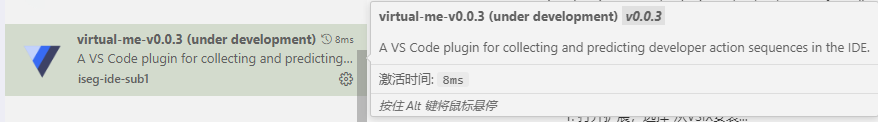

<h1 align="center">VirtualMe</h1>

VirtualMe is a VS Code plugin <i>under development</i> for collecting developer action sequences and providing developer intention prediction in the IDE.

| <a href="https://github.com/iseg-ide-sub1/virtual-me/blob/main/res/docs/building.md"><b>Building</b></a> | <a href="https://github.com/iseg-ide-sub1/virtual-me/blob/main/res/docs/plugin-architecture-v2.md"><b>Architecture</b></a> | <a href="https://github.com/iseg-ide-sub1/virtualme-backend"><b>Backend</b></a> |

This document was last updated on January 20, 2025.
文档更新于 2025.01.20。

This plugin is under development and is currently only available for developers and data collectors.
该插件正在开发，当前仅供开发者和数据收集人员使用。

This plugin currently works exclusively with our custom-built VS Code and cannot be used properly in the official VS Code IDE.
该插件当前仅适用于我们自行构建的 VS Code，在官方 VS Code IDE 中无法正常使用。

## 安装和使用

图片可能已经过时，以最新版插件界面为准，插件机制细节参考 [**plugin-architecture.md**](./res/docs/plugin-architecture-v2.md)

1. 打开扩展，选择“从VSIX安装...”

   
   
2. 选择本插件 `.vsix` 文件打开，安装完成

   
   
3. 安装后在活动条（Activity Bar）中即可看到对应图标，点击即可打开插件界面并激活插件
   
   
   
4. 插件界面提供了一些功能，可进行需要的操作
   
5. 此时即可开始在 IDE 进行工作，插件会自动收集数据（数据收集类型见下文）

6. 对于数据保存操作，也可以这样执行：按 `Ctrl+Shift+P` 打开命令面板，输入 `virtualme.savelog` 保存操作记录，或者使用快捷键 `Ctrl+Alt+S` 直接保存操作记录
   > 注意：
   >
   > - 保存操作记录后，插件会清空记录数据的缓存
   > - 目前插件每缓存 100 条数据就会自动保存
   
   
   
7. 操作记录被保存在当前工作目录下的 `virtualme-logs` 文件夹

   > 注意：只要启动了插件，如果没保存操作记录，插件会在 IDE 正常退出时自动保存记录

   

## 信息收集清单

### 数据收集格式

### 数据收集类型

收集数据的触发条件和详细格式见 [**plugin-architecture.md**](./res/docs/plugin-architecture-v2.md)

注：编号中带 `*` 的操作表示该操作测试有一定问题，需要在之后的版本修复，具体问题可参考 [**plugin-architecture.md**](./res/docs/plugin-architecture-v2.md)

#### 文件操作

| 编号 | 名称           | 符号                 | 推出版本 |
| ---- | -------------- | -------------------- | -------- |
| 1-1  | 打开文本文件   | `OpenTextDocument`   | v0.0.1   |
| 1-2  | 关闭文本文件   | `CloseTextDocument`  | v0.0.1   |
| 1-3  | 切换文本编辑器 | `ChangeTextDocument` | v0.0.1   |
| 1-4  | 新建文件       | `CreateFile`         | v0.0.1   |
| 1-5  | 删除文件       | `DeleteFile`         | v0.0.1   |
| 1-6  | 保存文件       | `SaveFile`           | v0.0.1   |
| 1-7  | 重命名文件     | `RenameFile`         | v0.0.1   |
| 1-8  | 移动文件       | `MoveFile`           | v0.0.1   |

#### 文本内容操作

| 编号 | 名称         | 符号                 | 推出版本 |
| ---- | ------------ | -------------------- | -------- |
| 2-1  | 添加文件内容 | `AddTextDocument`    | v0.0.1   |
| 2-2  | 删除文件内容 | `DeleteTextDocument` | v0.0.1   |
| 2-3  | 修改文件内容 | `EditTextDocument`   | v0.0.1   |
| 2-4  | 重做文件内容 | `RedoTextDocument`   | v0.0.1   |
| 2-5  | 撤销文件内容 | `UndoTextDocument`   | v0.0.1   |
| 2-6  | 选中文本     | `SelectText`         | v0.0.1   |
| 2-7  | 鼠标悬停     | `MouseHover`         | v0.0.2   |

#### 终端操作

| 编号   | 名称         | 符号                     | 推出版本 |
| ------ | ------------ | ------------------------ | -------- |
| 3-1    | 打开终端     | `OpenTerminal`           | v0.0.1   |
| 3-2    | 关闭终端     | `CloseTerminal`          | v0.0.1   |
| 3-3    | 切换终端     | `ChangeActiveTerminal`   | v0.0.1   |
| 3-4`*` | 执行终端命令 | `ExecuteTerminalCommand` | v0.0.2   |

#### 执行菜单项

| 编号 | 名称       | 符号              | 推出版本 |
| ---- | ---------- | ----------------- | -------- |
| 4-1  | 执行菜单项 | `ExecuteMenuItem` | v0.0.3   |

## 数据收集计划

当前需要使用插件收集数据，用于项目的模型训练，数据提交地址：

https://bhpan.buaa.edu.cn/link/AADE8B31BF7B03487DAB3BB279534A2D47

### 数据提交规范

1. 请将文件夹打包成压缩包上传，一个压缩包可以放多个文件夹
2. 对于不同的项目收集的数据请用不同的文件夹，文件夹命名建议用：项目名称_插件版本号，如：`Photo2Pixel_0.0.3`
3. 对于每个文件夹的数据最好写一个简单的文档大致介绍收集数据期间对仓库进行了什么操作

示例：

`LRM_001.zip` 【压缩包命名参考：前三位字母标识符_序号.zip】

- `DateTime_0.0.3` 【文件夹，命名用项目名称_插件版本号】
     - `*.json` 【收集的数据】
     - `README.md` 【数据说明文档】
- `VirtualMe_0.1.0` 【一个压缩包可以放多个文件夹】
  - `*.json` 【收集的数据】
  - `README.md` 【数据说明文档】
