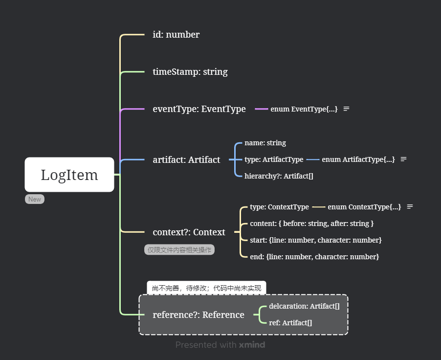

# 插件架构

## 事件总览

### 文件级事件

| 编号 | 名称           | 符号                   | 开发人员 | 是否实现 |
| ---- | -------------- | ---------------------- | -------- | -------- |
| 1-1  | 打开文本文件   | `OpenTextDocument`   |          |    Y      |
| 1-2  | 关闭文本文件   | `CloseTextDocument`  |          |    Y      |
| 1-3  | 切换文本编辑器 | `ChangeTextDocument` |          |     Y     |
| 1-4  | 新建文件       | `CreateFile`         |          |    Y     |
| 1-5  | 删除文件       | `DeleteFile`         |          |    Y     |
| 1-6  | 保存文件       | `SaveFile`           |          |    Y     |
| 1-7  | 重命名文件     | `RenameFile`         |          |    Y      |
| 1-8  | 移动文件       | `MoveFile`           |          |    Y     |
| 1-9  | 粘贴文件       | `PasteFile`          |          |    X     |

### 文本内容相关事件

| 编号 | 名称         | 符号                   | 开发人员 | 是否实现 |
| ---- | ------------ | ---------------------- | -------- | -------- |
| 2-1  | 添加文件内容 | `AddTextDocument`    | PZP      | Y        |
| 2-2  | 删除文件内容 | `DeleteTextDocument` |          | Y        |
| 2-3  | 修改文件内容 | `EditTextDocument`   |          | Y        |
| 2-4  | 重做文件内容 | `RedoTextDocument`   |          | Y        |
| 2-5  | 撤销文件内容 | `UndoTextDocument`   |          | Y        |
| 2-6  | 选中文本     | `SelectText`         |          | Y        |
| 2-7  | 查找文件内容 |                        |          | X        |
| 2-8  | 替换文件内容 |                        |          | X        |
| 2-9  | 重命名符号   |                        |          | X        |
| 2-10 | 文本跳转     |                        |          | X        |

### 终端事件

| 编号 | 名称         | 符号                   | 开发人员 | 是否实现 |
| ---- | ------------ | ---------------------- | -------- | -------- |
| 3-1  | 打开终端     | `OpenTerminal`         | LSW      | Y        |
| 3-2  | 关闭终端     | `CloseTerminal`        | LSW      | Y        |
| 3-3  | 切换终端     | `ChangeActiveTerminal` | LSW      | Y        |
| 3-4  | 执行终端命令 |                        |          | X        |
| 3-5  | 终端输出内容 |                        |          | X        |

### 其他事件

| 编号 | 名称     | 符号 | 开发人员 | 是否实现 |
| ---- | -------- | ---- | -------- | -------- |
| 4-1  | 鼠标滚动 |      |          | X        |
| 4-2  | 版本控制 |      |          | X        |

## 事件属性

[log-item.xmind](../raw/log-item.xmind)



### 通用属性

以下属性为通用属性，每个事件类型都会包含

- `id: number`  在本次记录中的序号
- `timeStamp: string`  记录本事件的时间戳
- `eventType: EventType`  事件类型
- `artifact: Artifact`  操作工件
  - `name: string` 工件名称
  - `type: ArtifactType` 工件类型
  - `hierarchy?: Artifact[]` 该工件的层级（可能没有）

### 1-1 `OpenTextDocument`

**实现API：**`vscode.workspace.onDidOpenTextDocument`

**触发条件：**打开文本文件时触发

**附加属性：**无

**示例数据：**

```json
  {
    "id": 1,
    "timeStamp": "2024-11-11 15:25:19.823",
    "eventType": "Open text document",
    "artifact": {
      "name": "file:///c%3A/Users/hiron/Desktop/Code/test.c",
      "type": "File"
    }
  }
```

### 1-2 `	CloseTextDocument`

**实现API：**`vscode.workspace.onDidCloseTextDocument`

**触发条件：**关闭文本文件时触发

**附加属性：**无

**示例数据：**

```json
  {
    "id": 1,
    "timeStamp": "2024-11-11 15:28:27.566",
    "eventType": "Close text document",
    "artifact": {
      "name": "file:///c%3A/Users/hiron/Desktop/Code/test.c",
      "type": "File"
    },
    "detail": {}
  }
```

### 1-3 `	CloseTextDocument`

**实现API：**`vscode.window.onDidChangeActiveTextEditor`

**触发条件：**

切换文本文件时触发，若当前关闭所有编辑视图，`editor` 值为 `undefined`

切换编辑视图，会触发两次此事件，第一次 `editor` 值为 `undefined`

插件不会记录 `editor` 值为 `undefined` 的情况

**附加属性：**无

**示例数据：**

```json
  {
    "id": 3,
    "timeStamp": "2024-11-11 15:28:28.243",
    "eventType": "Change text document",
    "artifact": {
      "name": "file:///c%3A/Users/hiron/Desktop/Code/test2.c",
      "type": "File"
    },
    "detail": {}
  }
```

### 1-4 `CreateFile`

### 1-5 `DeleteFile`

### 1-6 `SaveFile`

### 2-6 `SelectText`

**实现API：**

**触发条件：**鼠标、键盘、命令都可能触发该事件，仅仅移动光标，也会触发此事件

**注意：**

1. 插件进行了处理，只有选择的文本内容不为空时才记录
2. 如果选择的内容横跨多个工件，按整体进行计算（也就是层级中的工件需要同时包含选择内容的开始位置和结束位置）
3. 为节省空间 `artifact.conext.after` 一定为空
4. 在使用鼠标或键盘进行选择时，选择区域每扩大一次就会记录一次选中，这使得记录内容暴增，优化：当连续选择时，如果两次选择操作间隔小于1000毫秒，且上次选择内容是新选择内容的子集，那么删除上次选择记录

**附加属性：**`context`

**示例数据：**

```json
{
    "id": 17,
    "timeStamp": "2024-11-13 22:04:27.317",
    "eventType": "SelectText",
    "artifact": {
      "name": "Student",
      "type": "Class",
      "hierarchy": [
        {
          "name": "c:\\Users\\hiron\\Desktop\\Code\\testplus.cpp",
          "type": "File"
        },
        {
          "name": "Student",
          "type": "Class"
        }
      ]
    },
    "context": {
      "type": "Select",
      "content": {
        "before": "class Course{\r\n    private:\r\n        int course_id;\r\n        char course_name[20];\r\n    };",
        "after": "class Course{\r\n    private:\r\n        int course_id;\r\n        char course_name[20];\r\n    };"
      },
      "start": {
        "line": 7,
        "character": 5
      },
      "end": {
        "line": 11,
        "character": 7
      }
    }
  }
```

### 3-1 `OpenTerminal`

**实现 API**：`vscode.window.onDidOpenTerminal`

**触发条件**：在 Vs Code 中打开新的终端

**示例数据**：

```json
  {
    "id": 4,
    "timeStamp": "2024-11-19 23:00:58.141",
    "eventType": "OpenTerminal",
    "artifact": {
      "name": "2168", // 进程 id，用于区别不同终端
      "type": "Terminal"
    }
  },
```

### 3-2 `CloseTerminal`
**实现 API**：`vscode.window.onDidCloseTerminal`

**触发条件**：在 Vs Code 中关闭终端

**示例数据**：

```json
  {
    "id": 2,
    "timeStamp": "2024-11-19 23:00:53.373",
    "eventType": "CloseTerminal",
    "artifact": {
      "name": "2085",
      "type": "Terminal"
    }
  },
```
### 3-3 `ChangeActiveTerminal`
**实现 API**：`vscode.window.onDidChangeActiveTerminal`

**触发条件**：在 Vs Code 中切换不同的终端

**示例数据**：

```json
  {
    "id": 8,
    "timeStamp": "2024-11-19 22:19:28.982",
    "eventType": "ChangeActiveTerminal",
    "artifact": {
      "name": "64942->65654", // 涉及到的终端进程 id
      "type": "Terminal"
    }
  }
```

## 插件代码组织结构

### `extension.ts`

插件入口，全局变量（LogItem），Subscriptions

### `log-item.ts`

事件数据结构

### `utils/common.ts`

保存通用函数

### `utils/process.ts`

保存数据预处理函数

## 数据保存约定

### 文件命名

`日期 时间 仓库名称.json`

```
2024-10-29 14-16-15 VirtualMe.json
```

### log

一个文件夹用于保存自己测试生成的数据（该文件夹放到 gitignore 中）

### dataset

一个文件夹用于专门保存有用的数据（数据集）
